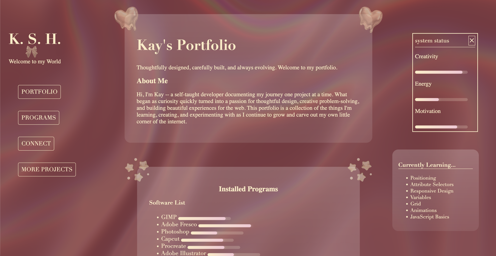

# Portfolio Landing Page V2

This is the second version of my personal portfolio landing page. The goal of this project was to create a cleaner, more polished portfolio homepage that better represents my current HTML and CSS skills, my featured projects, and my progress as a web developer.

## Project Goal

The main goal of this project was to redesign my portfolio landing page so it felt more professional, organized, and easier to navigate. I wanted the page to clearly introduce who I am, show my current projects, and create a stronger first impression for anyone viewing my work.

## What I Built

- A refreshed personal portfolio landing page with a cleaner structure and updated visual design.
- A featured projects section to highlight my current web development work.
- Project cards with clickable links for viewing live projects, source code, and case studies.
- A more organized layout that makes my work easier to browse.
- A responsive design that improves the viewing experience across different screen sizes.

## Featured Projects

### Learning Dashboard

A personal learning dashboard built to organize my coding progress, study goals, completed topics, and project work. This project helped me practice layout structure, cards, spacing, and turning a personal tool into a portfolio-ready project.

### Myth & Mana

A fantasy-inspired editorial magazine homepage focused on CSS Grid, visual hierarchy, creative direction, and atmosphere. This project helped me practice building a more dynamic layout with larger featured sections, supporting content cards, and a consistent themed design.

## What I Learned

- How to improve an existing project instead of starting over from scratch.
- How to create a stronger visual hierarchy using spacing, sizing, and section structure.
- How to make project cards and links feel more organized and intentional.
- How to use consistent styling across a full portfolio page.
- How to better present projects as portfolio pieces instead of just completed assignments.
- How to troubleshoot layout issues, image sizing, spacing, and card structure.

## Future Improvements

- Continue improving responsiveness across desktop, tablet, and mobile screens.
- Refine spacing and box sizing on project and case study sections.
- Add more completed projects as my skills grow.
- Improve project case studies with clearer descriptions, screenshots, and reflections.
- Add small animations or transitions later while keeping the design clean and readable.

## Tech Used

- HTML
- CSS
- GitHub Pages

## Reflection

This version of my portfolio shows my growth from building simple static pages to creating a more polished and intentional personal website. It helped me practice not only HTML and CSS, but also project presentation, visual organization, and design consistency.

## Screenshot

